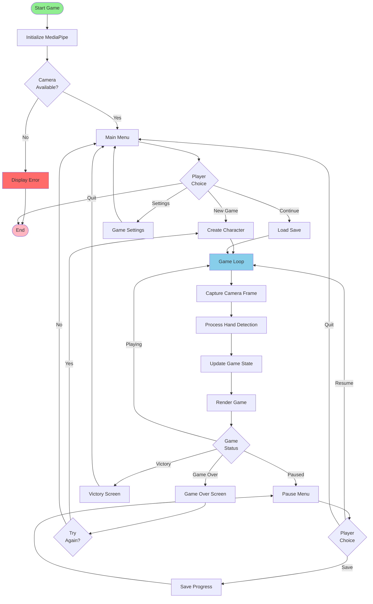
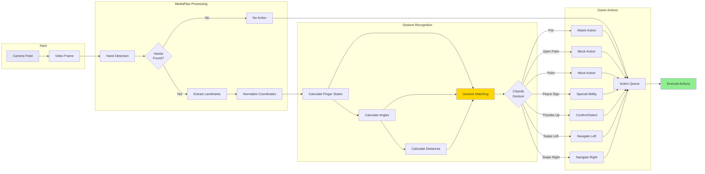
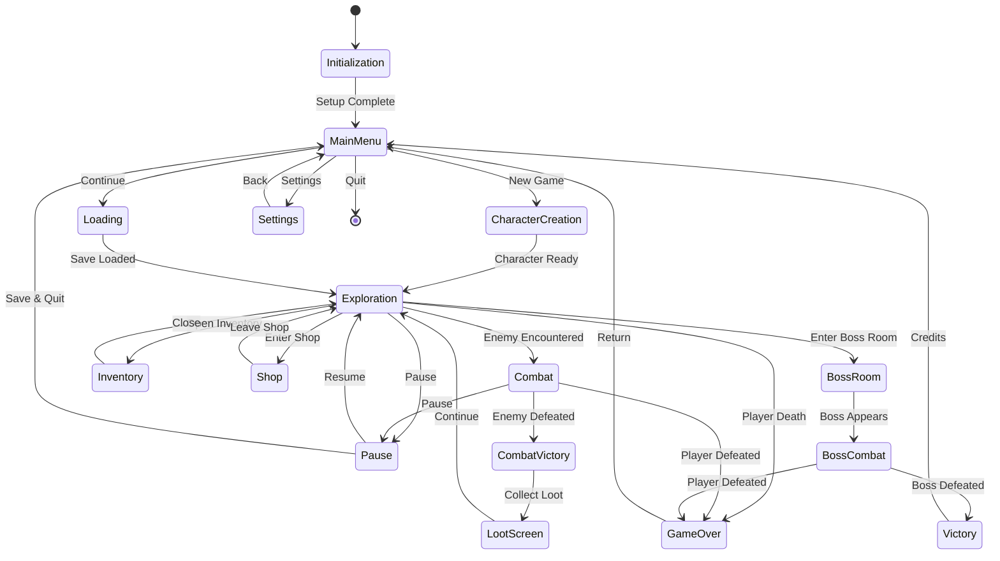
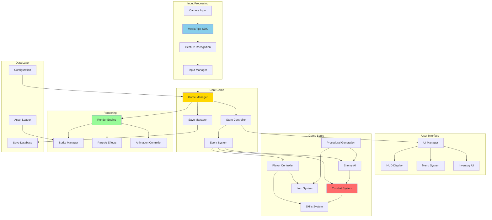
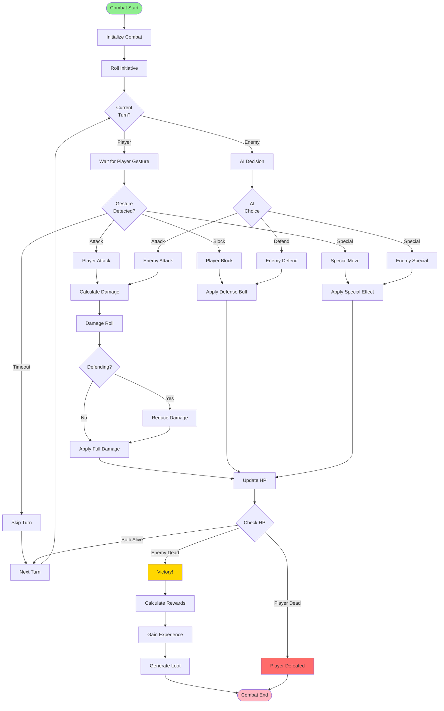
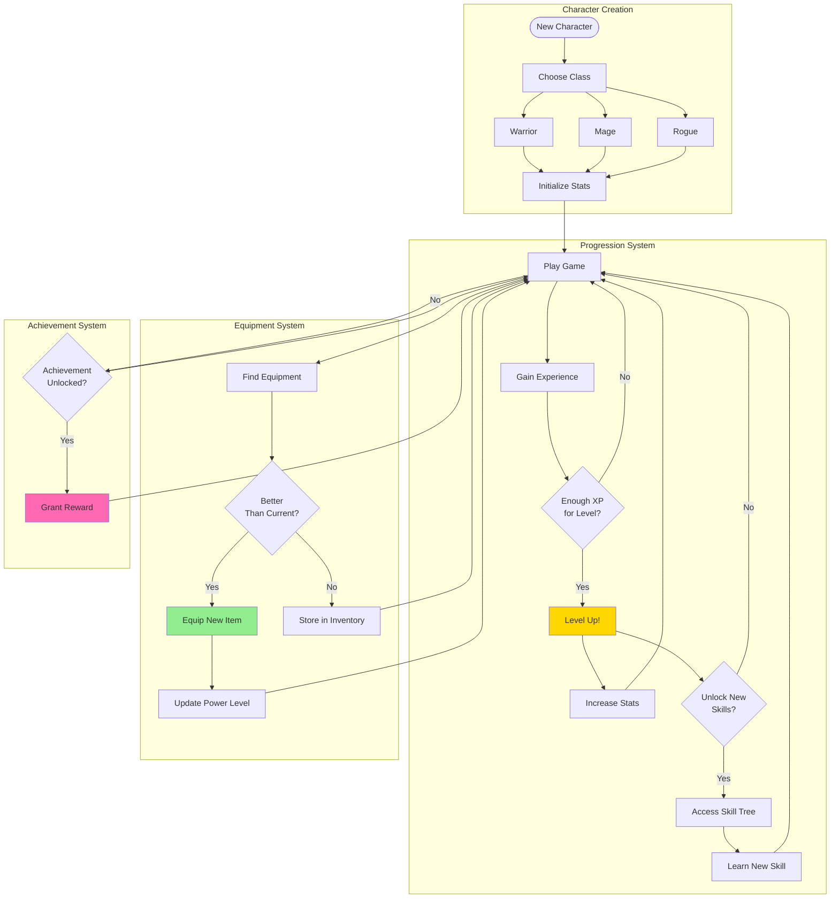
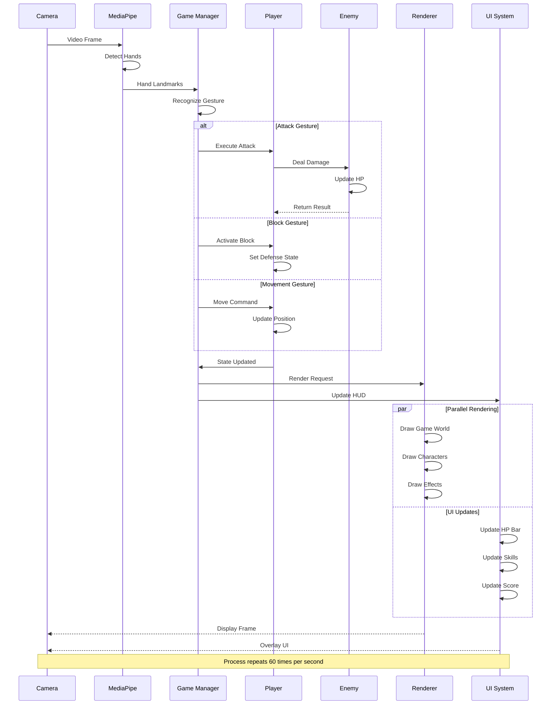
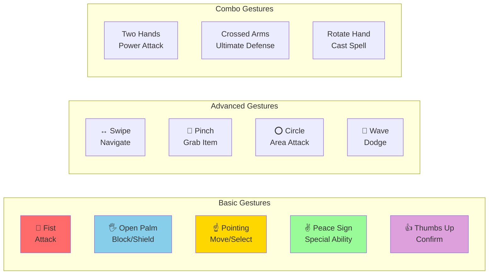

# Hand MediaPipe Roguelike Game - Architecture Documentation

This document provides visual flowcharts to help understand the game's architecture and data flow.

## Table of Contents
- [Game Flow](#game-flow)
- [Hand Gesture Processing](#hand-gesture-processing)
- [Game State Machine](#game-state-machine)
- [System Architecture](#system-architecture)
- [Combat System](#combat-system)
- [Player Progression](#player-progression)

---

## Game Flow

This flowchart shows the overall game execution flow from start to finish.

---

## Hand Gesture Processing

This diagram illustrates how hand gestures are detected and converted into game actions.

---

## Game State Machine

This state machine shows the different game states and their transitions.

---

## System Architecture

This diagram shows the high-level system architecture and component interactions.

---

## Combat System

This flowchart details the combat mechanics and action resolution.

---

## Player Progression

This diagram illustrates the player progression and character development system.

---

## Data Flow Architecture

This sequence diagram shows how data flows through the system during gameplay.

---

## Gesture Patterns

Visual reference for hand gesture patterns used in the game.

